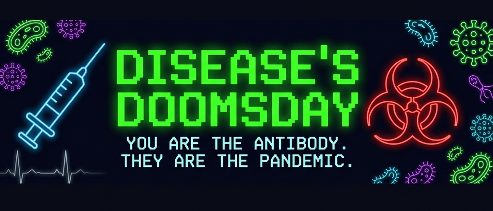

<div align="center">



<br/>

### 🧬 _Você é um anticorpo. Eles são a pandemia. Só um sobrevive._

<br/>

[](LICENSE)


<br/>

> **Jogo educativo de saúde pública — desenvolvido como Projeto Integrador**
> Uma arena de ação 2D top-down onde cada inimigo é uma doença real, cada arma é um conceito científico, e cada vitória é uma aula de epidemiologia.

</div>

---

## ⚠️ O CENÁRIO

```
╔══════════════════════════════════════════════════════════════════╗
║  ALERTA BIOLÓGICO — PROTOCOLO IMUNOLÓGICO ATIVADO               ║
║                                                                  ║
║  • KPC resistente a antibióticos detectada na corrente sanguínea ║
║  • Surto de Dengue ativo — vetor Aedes aegypti confirmado        ║
║  • Influenza em propagação aérea exponencial                     ║
║  • Pneumonia bacteriana disseminada em alvéolos                  ║
║                                                                  ║
║  > INJETANDO ANTICORPO EM T-MENOS 3... 2... 1...                ║
╚══════════════════════════════════════════════════════════════════╝
```

O paciente está infectado. O sistema imunológico está sobrecarregado.
Você, um **anticorpo programado**, é a última linha de defesa.

---

<div align="center">

## 🎮 O QUE É ESTE JOGO?

</div>

**Disease's Doomsday** é um jogo de ação em arena com proposta **educacional de saúde pública**. O jogador assume o papel de um anticorpo injetado na corrente sanguínea de um paciente infectado — eliminando patógenos onda após onda enquanto aprende conceitos reais de **vigilância epidemiológica, prevenção de doenças e imunologia**.

O projeto une **entretenimento e aprendizagem ativa**, traduzindo conteúdos de saúde pública em mecânicas de jogo coerentes, didáticas e — acima de tudo — divertidas.

---

## 🦠 OS INIMIGOS — Doenças Reais, Mecânicas Reais

| Patógeno                          | Tipo            | Comportamento em Jogo                          | Conceito Real                                      |
| --------------------------------- | --------------- | ---------------------------------------------- | -------------------------------------------------- |
| 🦠 **Superbactéria KPC**          | CHEFE Mundo 1   | 3 fases, escolta de lacaios, projéteis radiais | Resistência antimicrobiana, infecções hospitalares |
| 🦟 **Dengue** _(Aedes aegypti)_   | Atirador        | Rápido, zigue-zague, foge do jogador           | Transmissão vetorial, eliminação de criadouros     |
| 😷 **SARS-CoV-2**                 | Corpo a corpo   | Equilibrado, ataque em grupo                   | Transmissão respiratória, protocolos de isolamento |
| 🔬 **Mycobacterium tuberculosis** | Atirador Pesado | Lento e extremamente resistente                | TB pulmonar, resistência a múltiplos fármacos      |
| 🩸 **Trypanosoma cruzi**          | Speedrunner     | Veloz, frágil, invoca vetores aliados          | Doença de Chagas, transmissão por triatomíneo      |
| 🧬 **Vírus Boss**                 | CHEFE Mundo 2   | Capsídeo reforçado, múltiplas camadas          | Estrutura viral, mecanismos de infecção            |

---

## ⚔️ O ARSENAL — Ciência como Arma

> _Cada arma existe por um motivo científico. Não é ficção — é biologia._

```
┌─────────────────────────────────────────────────────────────────┐
│  MUNDO 1 — BACTÉRIAS                                            │
│                                                                 │
│  🔪 Espada-Seringa ........... Golpe 360° com knockback         │
│  🦠 Rifle de Bacteriófagos ... Vírus que ataca bactérias (real) │
│  💣 Desestabilizador de RNA .. Granada de área, dana o RNA      │
│  💉 Citocina de Estabilização . Regeneração — análogo ao imune  │
├─────────────────────────────────────────────────────────────────┤
│  MUNDO 2 — VÍRUS                                                │
│                                                                 │
│  ⚡ Escalpelizador Estático .. Quebra capsídeo rapidamente      │
│  💉 Rifle de Vacina .......... Projétil eficaz vs. vírus        │
├─────────────────────────────────────────────────────────────────┤
│  DROPS ESPECIAIS (ambos os mundos)                              │
│                                                                 │
│  😷 Máscara Hospitalar ....... Reduz dano recebido              │
│  📏 Distanciamento Social .... Aura que repele inimigos         │
└─────────────────────────────────────────────────────────────────┘
```

---

## 🗺️ MAPA DA CAMPANHA

```
  [INÍCIO]
     │
     ▼
  📋 Tutorial — Seringa de Vacina
     │
     ▼
  🎬 Cutscene: "Injeção na corrente sanguínea"
     │
     ▼
  ══════════════════════════════
  🦠  MUNDO 1 — INFESTAÇÃO BACTERIANA
  ══════════════════════════════
     │
     ├── 🌊 Onda 1-4 ── Patógenos + Quiz Epidemiológico + Pontos do SUS
     │
     └── 🌊 Onda 5 ─── 👑 CHEFE: Superbactéria KPC
                              [FASE 1] → [FASE 2] → [FASE 3]
                                               │
                                               ▼
                                    🎬 Cutscene Educativa
                                               │
                                               ▼
  ══════════════════════════════
  🧬  MUNDO 2 — INVASÃO VIRAL
  ══════════════════════════════
     │
     ├── 🌊 Onda 1-4 ── Vírus c/ Capsídeo + Quiz + Upgrades
     │
     └── 🌊 Onda 5 ─── 👑 CHEFE VIRAL: Capsídeo Reforçado
                                               │
                                               ▼
                                     🏆  VITÓRIA FINAL
                                    "O paciente sobreviveu."
```

---

## 🎓 PROPOSTA EDUCACIONAL

O jogo aborda, de forma **lúdica e cientificamente embasada**, temas centrais de saúde pública:

| Tema                     | Conteúdo Ensinado                                                                   |
| ------------------------ | ----------------------------------------------------------------------------------- |
| **Superbactéria KPC**    | Resistência antimicrobiana, infecções hospitalares, uso responsável de antibióticos |
| **Dengue**               | Transmissão pelo _Aedes aegypti_, eliminação de criadouros, prevenção no DF/Brasil  |
| **Influenza**            | Vacinação, transmissão respiratória, medidas de proteção individual e coletiva      |
| **Pneumonia Bacteriana** | Agentes causadores, ambientes de risco, estratégias de prevenção                    |
| **Sistema Imune**        | Anticorpos, bacteriófagos, capsídeo viral, papel das citocinas                      |

### 🧠 Quiz da Vigilância Epidemiológica

Entre cada onda, o jogador responde perguntas sobre saúde pública. Acertar rende **Pontos do SUS** — que podem ser gastos em melhorias permanentes do personagem:

```
✅ Resposta correta ──► +Pontos do SUS
                              │
             ┌────────────────┼─────────────────┐
             ▼                ▼                  ▼
      Vida Máxima +100   Velocidade +15%    Dano +10
          (50 pts)          (50 pts)        (50 pts)
```

---

## 🕹️ CONTROLES

| Ação            | Tecla                              |
| --------------- | ---------------------------------- |
| Mover           | `W` `A` `S` `D` ou `↑` `↓` `←` `→` |
| Atacar          | **Clique Esquerdo** ou `Espaço`    |
| Trocar Arma     | `1` `2` `3` `4`                    |
| Usar Poção      | `E`                                |
| Avançar Diálogo | `Q` ou `Espaço`                    |
| Pausar          | `Esc`                              |
| Salvar          | `F5`                               |
| Carregar        | `F9`                               |

---

## 🏗️ ARQUITETURA DO PROJETO

```
Disease's_Doomsday/
├── Game/
│   ├── src/
│   │   ├── main.c                  # Janela, loop principal, música, letterbox
│   │   ├── logic/
│   │   │   ├── update_gameplay.c   # Núcleo: movimento, IA, colisões, ondas
│   │   │   └── fsm.c               # Máquina de estados das telas
│   │   ├── gameplay/
│   │   │   ├── input_controller.c  # Entrada de UI e menus
│   │   │   └── spatial_grid.c      # Grid espacial para colisões otimizadas
│   │   ├── render/
│   │   │   └── render_gameplay.c   # HUD, mundo, inimigos, projéteis, tutorial
│   │   ├── entities/               # player.c · enemy.c · projectiles.c
│   │   ├── systems/
│   │   │   ├── combat_system.c     # Dano ao jogador e efeitos de impacto
│   │   │   └── wave_manager.c      # Geração de ondas e do chefe (por Mundo)
│   │   ├── telas/                  # telas.c · tela_quiz.c · tela_upgrade.c
│   │   └── assets/
│   │       ├── asset_manager.c     # Fonte, música, SFX, shaders
│   │       └── sprite_manager.c    # Pipeline de sprites (PNG + fallback procedural)
│   ├── include/                    # game.h · gameplay.h · telas.h
│   ├── Assets/
│   │   ├── Maps/                   # map_seringa.c · map_body.c
│   │   ├── Sprites/                # Player/ · Enemies/ · Weapons/ · Items/ · UI/
│   │   └── @models/                # player_model.c · enemy_model.c
│   ├── Saves/                      # Slots de save (.txt) + screenshots de preview
│   ├── compilar.bat                # Build Windows
│   ├── Makefile                    # Build Linux/macOS
│   └── build.sh                    # Atalho Linux/macOS
├── README.md
├── elicitacao.md                   # 5W2H, público-alvo, stakeholders
├── COMO_RODAR.md
└── PROMPT_CLAUDE_CODE.md
```

---

## 🔧 DESTAQUES TÉCNICOS

| Recurso             | Implementação                                                          |
| ------------------- | ---------------------------------------------------------------------- |
| **Engine**          | Raylib — janela redimensionável com _letterbox_ 1280×720               |
| **Arte**            | Pipeline procedural com suporte a sprites PNG externos                 |
| **Câmera**          | Suave (lerp) com _screen shake_ em impactos                            |
| **Partículas**      | Pool de reuso eficiente (sem alocação dinâmica em runtime)             |
| **Shaders**         | Efeito biológico + vinheta de vida baixa                               |
| **Áudio**           | Música em crossfade + SFX contextuais por evento                       |
| **IA dos Inimigos** | FSM `IDLE → AGGRO → ATTACK → HURT → DEATH` com flanqueamento           |
| **Save/Load**       | 3 slots `.txt` com screenshot de preview, escrita em thread assíncrona |
| **HUD**             | Radar/biossensor · barra de chefe · hotbar · rótulo de órgão/doença    |
| **Colisões**        | Grid espacial — O(1) por célula, sem brute-force                       |

---

## 🚀 COMO COMPILAR E RODAR

### 🪟 Windows

> Requer Raylib instalada em `C:\raylib` (instalador MinGW oficial)

**1. Instale o Raylib:**
Acesse [raylib.com](https://www.raylib.com/) → baixe `raylib_installer_vX.X.X.mingw.exe` → instale em `C:\raylib`

**2. Compile e execute** (dentro de `Game/`):

```bat
compilar.bat
rpg_game.exe
```

**3. (Opcional) Integração VS Code — `Game/.vscode/c_cpp_properties.json`:**

```json
{
  "configurations": [
    {
      "name": "Win32",
      "includePath": [
        "${workspaceFolder}/**",
        "C:/raylib/raylib/src",
        "C:/raylib/w64devkit/include"
      ],
      "compilerPath": "C:/raylib/w64devkit/bin/gcc.exe",
      "cStandard": "c11",
      "intelliSenseMode": "windows-gcc-x64"
    }
  ],
  "version": 4
}
```

---

### 🐧 Linux / 🍎 macOS

**1. Instale o Raylib:**

```bash
# Ubuntu/Debian
sudo apt install libraylib-dev

# macOS (Homebrew)
brew install raylib
```

**2. Compile e execute** (dentro de `Game/`):

```bash
make && ./rpg_game
# ou simplesmente:
./build.sh
```

> ⚠️ **Importante:** Execute **a partir da pasta `Game/`** — os caminhos de `Assets/` e `Saves/` são relativos ao executável.

---

## 📋 DOCUMENTAÇÃO

| Documento                        | Conteúdo                                              |
| -------------------------------- | ----------------------------------------------------- |
| [`README.md`](README.md)         | Visão geral, arquitetura, build e instalação          |
| [`elicitacao.md`](elicitacao.md) | 5W2H, público-alvo, stakeholders, custo computacional |
| [`LICENSE`](LICENSE)             | Licença MIT                                           |

---

<div align="center">

## 👥 EQUIPE

**Projeto acadêmico desenvolvido em C + Raylib**
Disciplina: **Projeto Integrador** — com enfoque em saúde pública do Distrito Federal

<br/>

_Uso educacional — ao reutilizar ou distribuir, mantenha os créditos dos autores_
_e da biblioteca [Raylib](https://www.raylib.com/)._

<br/>

---

```
[ O paciente está aguardando. O anticorpo está a postos. ]
              Boa sorte, Doutor.
```

</div>
